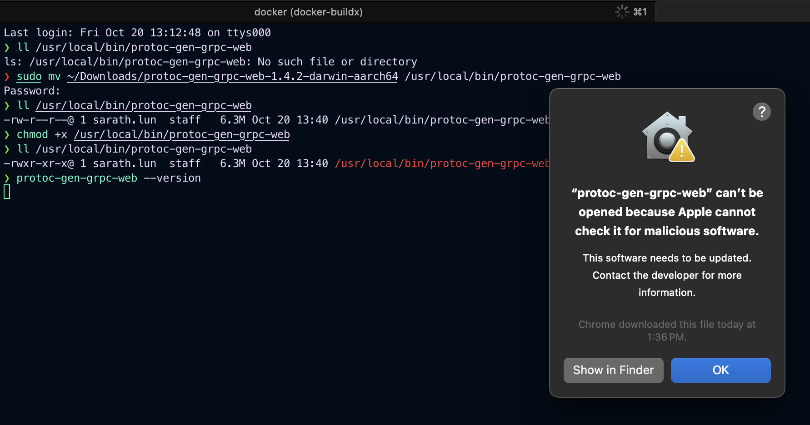
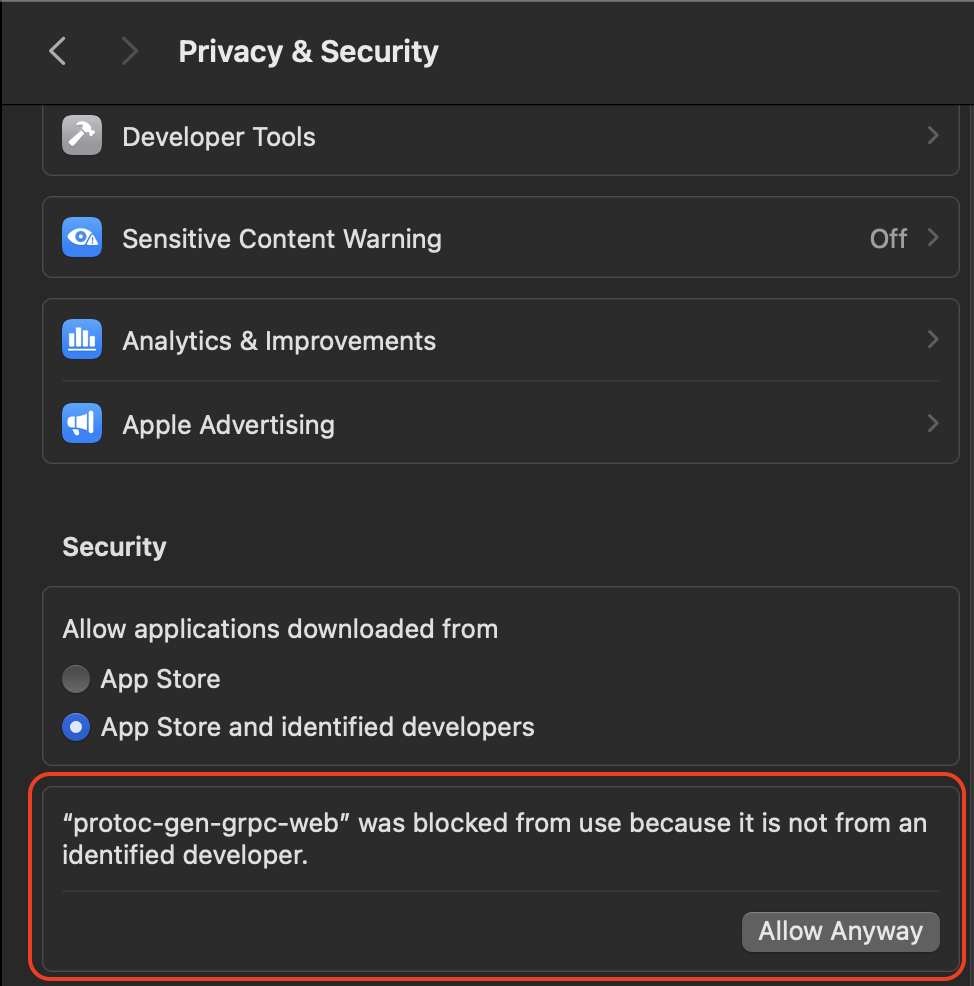
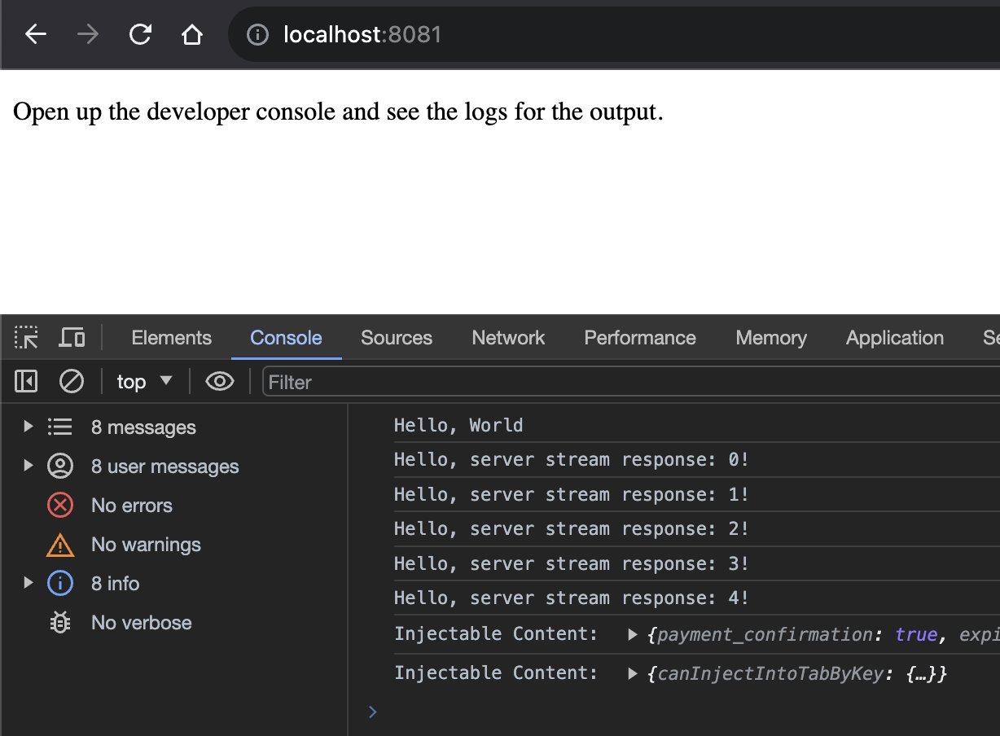

# gRPC-Web Hello World Guide

This guide is intended to help you get started with gRPC-Go & gRPC-Web with a simple
Hello World example.

## Define the Service

First, let's define a gRPC service using
[protocol buffers](https://developers.google.com/protocol-buffers/). Put this
in the `helloworld.proto` file. Here we define a request message, a response
message, and a service with one RPC method: `SayHello`.

```protobuf
syntax = "proto3";

option go_package = "github.com/SarathLUN/grpc-go-js;helloworld";
package helloworld;

service Greeter {
  rpc SayHello (HelloRequest) returns (HelloReply);
}

message HelloRequest {
  string name = 1;
}

message HelloReply {
  string message = 1;
}
```

## Generate protobuf for Go server

```shell
protoc --go_out=. --go_opt=paths=source_relative --go-grpc_out=. --go-grpc_opt=paths=source_relative proto/helloworld.proto
```

## Implement the Service

Then, we need to implement the gRPC Service. In this example, we will use
Go server.

```go

```

## Configure the Proxy

Next up, we need to configure the Envoy proxy to forward the browser's gRPC-Web
requests to the backend. Put this in an `envoy.yaml` file. Here we configure
Envoy to listen at port `:8080`, and forward any gRPC-Web requests to a
cluster at port `:9090`.

```yaml
admin:
  access_log_path: /tmp/admin_access.log
  address:
    socket_address: { address: 0.0.0.0, port_value: 9901 }

static_resources:
  listeners:
    - name: listener_0
      address:
        socket_address: { address: 0.0.0.0, port_value: 8080 }
      filter_chains:
        - filters:
            - name: envoy.filters.network.http_connection_manager
              typed_config:
                "@type": type.googleapis.com/envoy.extensions.filters.network.http_connection_manager.v3.HttpConnectionManager
                codec_type: auto
                stat_prefix: ingress_http
                route_config:
                  name: local_route
                  virtual_hosts:
                    - name: local_service
                      domains: ["*"]
                      routes:
                        - match: { prefix: "/" }
                          route:
                            cluster: greeter_service
                            timeout: 0s
                            max_stream_duration:
                              grpc_timeout_header_max: 0s
                      cors:
                        allow_origin_string_match:
                          - prefix: "*"
                        allow_methods: GET, PUT, DELETE, POST, OPTIONS
                        allow_headers: keep-alive,user-agent,cache-control,content-type,content-transfer-encoding,custom-header-1,x-accept-content-transfer-encoding,x-accept-response-streaming,x-user-agent,x-grpc-web,grpc-timeout
                        max_age: "1728000"
                        expose_headers: custom-header-1,grpc-status,grpc-message
                http_filters:
                  - name: envoy.filters.http.grpc_web
                    typed_config:
                      "@type": type.googleapis.com/envoy.extensions.filters.http.grpc_web.v3.GrpcWeb
                  - name: envoy.filters.http.cors
                    typed_config:
                      "@type": type.googleapis.com/envoy.extensions.filters.http.cors.v3.Cors
                  - name: envoy.filters.http.router
                    typed_config:
                      "@type": type.googleapis.com/envoy.extensions.filters.http.router.v3.Router
  clusters:
    - name: greeter_service
      connect_timeout: 0.25s
      type: logical_dns
      http2_protocol_options: {}
      lb_policy: round_robin
      # win/mac hosts: Use address: host.docker.internal instead of address: localhost in the line below
      load_assignment:
        cluster_name: cluster_0
        endpoints:
          - lb_endpoints:
              - endpoint:
                  address:
                    socket_address:
                      address: host.docker.internal
                      port_value: 9090
```

## Write Client Code

Now, we are ready to write some client code! Put this in a `client.js` file.

```js
const { HelloRequest, HelloReply } = require("./helloworld_pb.js");
const { GreeterClient } = require("./helloworld_grpc_web_pb.js");

var client = new GreeterClient("http://localhost:8080");

var request = new HelloRequest();
request.setName("World");

client.sayHello(request, {}, (err, response) => {
  console.log(response.getMessage());
});
```

The classes `HelloRequest`, `HelloReply` and `GreeterClient` we import here are
generated for you by the `protoc` generator utility (which we will cover in the
next section) from the `helloworld.proto` file we defined earlier.

Then we instantiate a `GreeterClient` instance, set the field in the
`HelloRequest` protobuf object, and we can make a gRPC call via
`client.sayHello()`, just like how we defined in the `helloworld.proto` file.

You will need a `package.json` file. This is needed for both the `server.js` and
the `client.js` files.

```json
{
  "name": "grpc-web-simple-example",
  "version": "0.1.0",
  "description": "gRPC-Web simple example",
  "main": "server.js",
  "devDependencies": {
    "@grpc/grpc-js": "~1.0.5",
    "@grpc/proto-loader": "~0.5.4",
    "async": "~1.5.2",
    "google-protobuf": "~3.14.0",
    "grpc-web": "~1.4.2",
    "lodash": "~4.17.0",
    "webpack": "~5.82.1",
    "webpack-cli": "~5.1.1"
  }
}
```

And finally a simple `index.html` file.

```html
<!DOCTYPE html>
<html lang="en">
  <head>
    <meta charset="UTF-8" />
    <title>gRPC-Web Example</title>
    <script src="./dist/main.js"></script>
  </head>
  <body>
    <p>Open up the developer console and see the logs for the output.</p>
  </body>
</html>
```

The `./dist/main.js` file will be generated by `webpack` (which will be covered
in the next section).

And that's it! We have all the code ready. Let's run the example!

## Generate Protobuf Messages and Client Service Stub

To generate the protobuf messages and client service stub class from your
`.proto` definitions, we need:

- the `protoc` binary, _and_
- the `protoc-gen-grpc-web` plugin.

> You can download the `protoc-gen-grpc-web` protoc plugin from our
> [release](https://github.com/grpc/grpc-web/releases) page.
>
> If you don't already have `protoc` installed, you will have to download it
> first from [here](https://github.com/protocolbuffers/protobuf/releases).
>
> Make sure they are both executable and are discoverable from your PATH.
>
> For example, in MacOS, you can do:
>
> ```sh
> $ sudo mv ~/Downloads/protoc-gen-grpc-web-1.4.2-darwin-x86_64 \
>   /usr/local/bin/protoc-gen-grpc-web
> $ sudo chmod +x /usr/local/bin/protoc-gen-grpc-web
> ```
>
> as usual, first run MacOS will require us to allow from **System Setting** => **Security & Privacy** >  > 
> after allowing this, we can run `protoc-gen-grpc-web` as normal.

When you have both `protoc` and `protoc-gen-grpc-web` installed, you can now
run this command:

```sh
$ protoc -I=. helloworld.proto \
  --js_out=import_style=commonjs:. \
  --grpc-web_out=import_style=commonjs,mode=grpcwebtext:.
```

> for MacOSX, I got error:
>
> ```shell
> protoc-gen-js: program not found or is not executable
> Please specify a program using absolute path or make sure the program is available in your PATH system variable
> --js_out: protoc-gen-js: Plugin failed with status code 1.
> ```
>
> this can be fixed by `npm install -g protoc-gen-js`, then we can run above command successful.

After the command runs successfully, you should now see two new files generated
in the current directory:

- `helloworld_pb.js`: this contains the `HelloRequest` and `HelloReply`
  classes
- `helloworld_grpc_web_pb.js`: this contains the `GreeterClient` class

These are also the 2 files that our `client.js` file imported earlier in the
example.

## Compile the Client JavaScript Code

Next, we need to compile the client side JavaScript code into something that
can be consumed by the browser.

```sh
$ npm install
$ npx webpack client.js
```

> `npx webpack client.js` I got error:
>
> ```shell
> ERROR in main
> Module not found: Error: Can't resolve 'client.js' in '/Users/sarath.lun/go-workspace/src/github.com/grpc-web/net/grpc/gateway/examples/helloworld'
> Did you mean './client.js'?
> ```
>
> this can be fixed by specify the path for client.js: `npx webpack ./client.js`

Here we use `webpack` and give it an entry point `client.js`. You can also use
`browserify` or other similar tools. This will resolve all the `require()`
statements and produce a `./dist/main.js` file that can be embedded in our
`index.html` file.

## Run the Example!

We are ready to run the Hello World example. The following set of commands will
run the 3 processes all in the background.

1.  Run the NodeJS gRPC Service. This listens at port `:9090` in the background process.

```sh
$ node server.js &
```

2.  Run the Envoy proxy. The `envoy.yaml` file configures Envoy to listen to
    browser requests at port `:8080`, and forward them to port `:9090` (see
    above).

```sh
$ docker run -d -v "$(pwd)"/envoy.yaml:/etc/envoy/envoy.yaml:ro \
   -p 8080:8080 -p 9901:9901 envoyproxy/envoy:v1.25-latest
```

3.  Run the simple Web Server. This hosts the static file `index.html` and
    `dist/main.js` we generated earlier, on port 8081 in the background process.

```sh
$ python3 -m http.server 8081 &
```

When these are all ready, you can open a browser tab and navigate to [localhost:8081](http://localhost:8081/).

Open up the developer console, and you should see the following printed out:

```
Hello! World
```


